# DukeAIforArt

Submission to 2019 Duke AI for Art Competition. Art pieces generated with the method of [Image Style Transfer Using Convolutional Neural Networks](https://www.cv-foundation.org/openaccess/content_cvpr_2016/papers/Gatys_Image_Style_Transfer_CVPR_2016_paper.pdf).

## Getting Started

### Prerequisites

```
tensorflow
opencv2
scipy
```

### Reproduce
To Reproduce the images, see [run.sh](https://github.com/danieltao/DukeAIforArt/blob/master/run.sh)


## Gallery
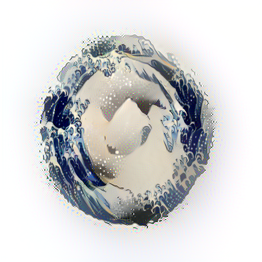
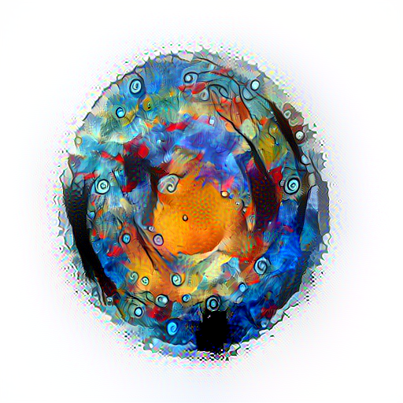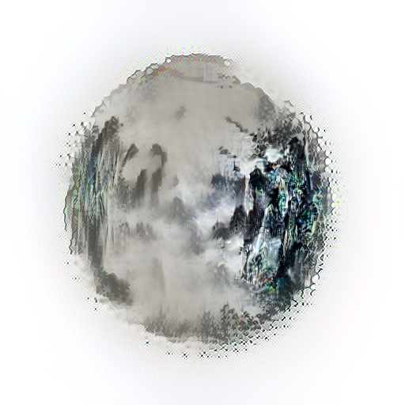
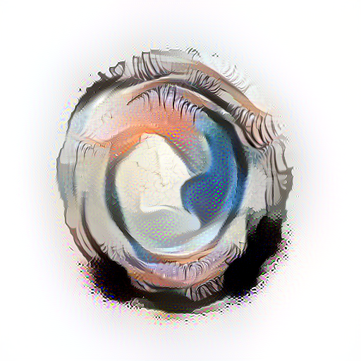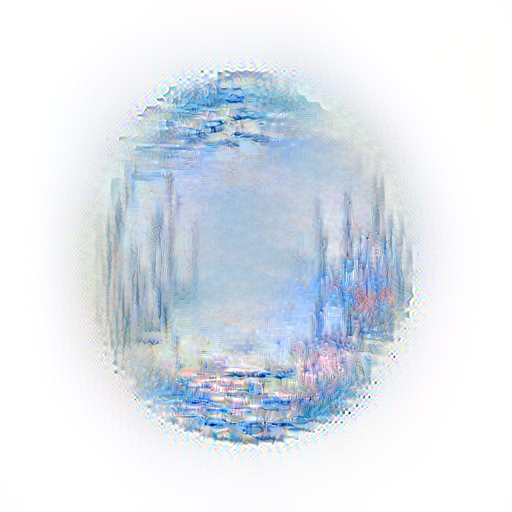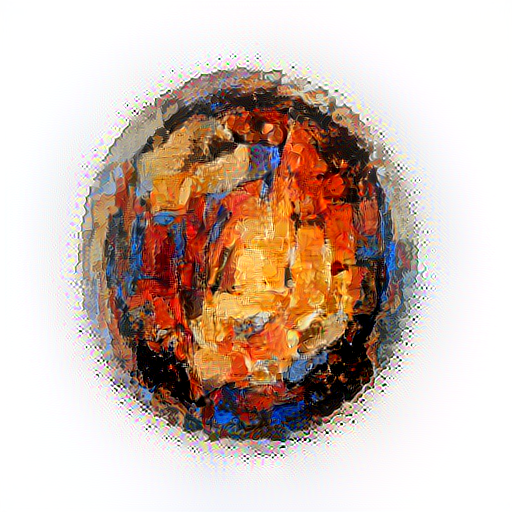

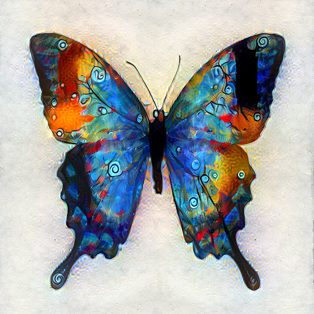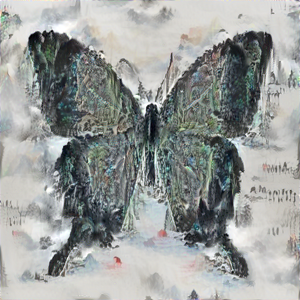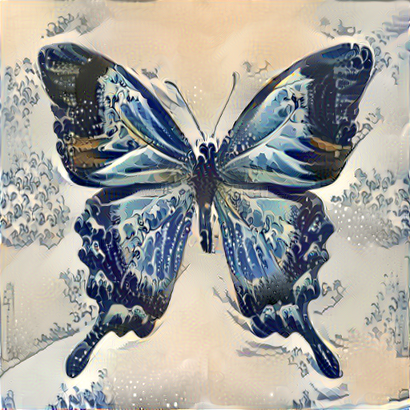
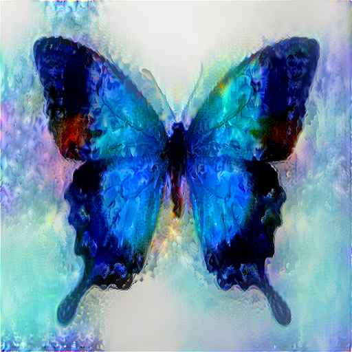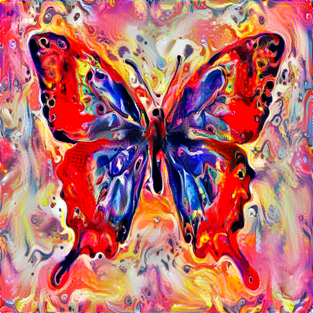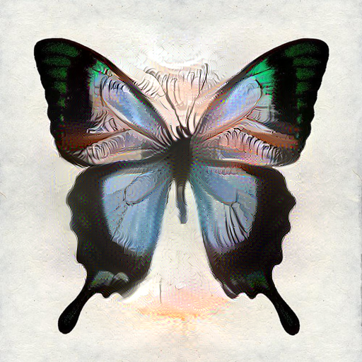
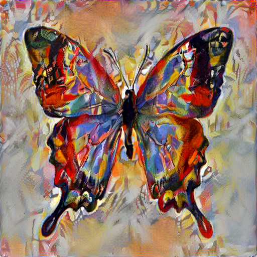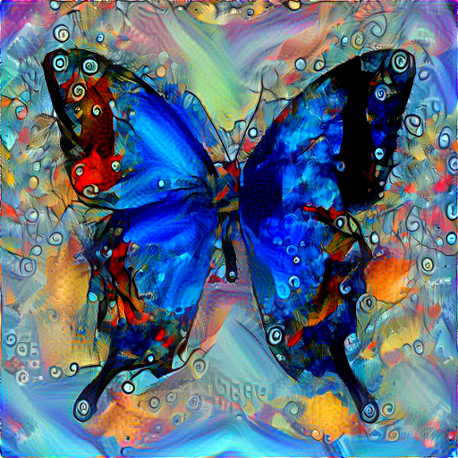


## Authors

* [**Daniel Tao**](https://www.danieltao.me)
* **Varun Nair**
